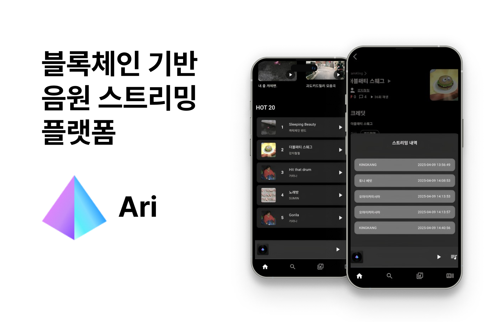

# 🎵 Ari - 블록체인 기반 음원 스트리밍 플랫폼

  

불투명한 정산과 복잡한 음원 등록 과정을 개선하기 위한 탈중앙화 음원 플랫폼입니다.  
투명한 스트리밍 데이터와 자동화된 정산 시스템으로 아티스트와 사용자 모두에게 공정한 생태계를 제공합니다.

---

## 📚 목차 (Table of Contents)
- [🧭 프로젝트 소개](#-프로젝트-소개)
- [🧩 문제 정의](#-문제-정의)
- [💡 해결방안](#-해결방안)
- [🔧 기술 구성](#-기술-구성)
  - [📦 아키텍처 요약](#-아키텍처-요약)
  - [🖼️ 와이어프레임](#-와이어프레임)
  - [📊 ERD](#-erd)
  - [🧱 주요 기술 스택](#-주요-기술-스택)
- [⚙️ 성능 개선 및 기술 고도화](#️-성능-개선-및-기술-고도화)
- [👥 팀 구성](#-팀-구성)

---

## 🧭 프로젝트 소개

- **기간**: (예: 2025.03.04 ~ 2025.04.11)
- **기획의도**:  
  기존 음원 플랫폼의 불투명한 정산과 복잡한 등록 과정을 개선하고, 블록체인 기술로 공정한 생태계를 구축하기 위함
- **핵심 컨셉**:  
  블록체인 기반으로 투명한 데이터 관리, 자동화된 정산, 누구나 쉽게 음원을 등록할 수 있는 플랫폼 제공

---

## 🧩 문제 정의

기존 음원 플랫폼은 다음과 같은 문제를 안고 있습니다:

- ❌ 불투명한 스트리밍 데이터  
- ❌ 불공정한 수익 정산 구조  
- ❌ 복잡하고 제한적인 음원 등록 과정  
- ❌ 불법 사재기 및 조회수 조작 문제  

---

## 💡 해결방안

Ari는 블록체인의 **투명성, 불변성, 탈중앙화** 특성을 활용하여 아래와 같은 기능을 구현합니다.

| 기능 | 설명 |
|------|------|
| 🔎 투명한 스트리밍 데이터 | IPFS + Merkle Tree를 통한 검증 가능한 데이터 |
| 💰 공정한 정산 시스템 | 스마트 컨트랙트를 활용한 온체인 정산 |
| 🚀 간편한 음원 등록 | 누구나 몇 번의 클릭으로 음원 등록 가능 |
| 🔄 자동화된 정산 | Chainlink Automation을 통한 구독 기반 정산 자동화 |

---

## 🔧 기술 구성

### 📦 아키텍처 요약

---

### 🖼️ 와이어프레임

---

### 📊 ERD

---

### 🧱 주요 기술 스택

### 🖥️ Client
  

### 🛠 Backend
   

### ⚙ Infra & 기타
     

---

## ⚙️ 성능 개선 및 기술 고도화

- 기존 스트리밍 내역 조회 시간: 평균 **46초**  
- 개선 후 핀닝 + 비동기 처리: 평균 **8초**  
  → `CompletableFuture` 구조 도입으로 응답 속도 대폭 개선

---

## 👥 팀 구성

### 🎧 캐릭캐릭체인 팀

<table>
  <tbody>
    <tr align="center">
      <td> </td>
      <td> </td>
      <td> </td>
      <td> </td>
      <td> </td>
      <td> </td>
    </tr>
    <tr align="center">
      <td width="200"><a href="http://github.com/miltonjskim">팀장 : 김준석 INFJ</a></td>
      <td width="200"><a href="http://github.com/wjdrbgus8167">팀원 : 정규현 ISFP</a></td>
      <td width="200"><a href="https://github.com/kingkang85">팀원 : 강지민 ISTP</a></td>
      <td width="200"><a href="https://github.com/naemhui">팀원 : 권남희 ENFP</a></td>
      <td width="200"><a href="https://github.com/songowen">팀원 : 송창현 ISTP</a></td>
      <td width="200"><a href="https://github.com/jinwooseok">팀원 : 진우석 ENTJ</a></td>
    </tr>
    <tr align="center" height="200">
      <td>온체인 정산 설계 및 구현 Redis, IPFS, 스마트컨트랙트 Chainlink 오토메이션</td>
      <td>시각화 / 디자인 구조 설계 정산 시각 자료 구성</td>
      <td>블록체인 인프라 구성 IPFS 데이터 구조 및 처리 CID, Merkle Tree 저장</td>
      <td>프론트엔드 메인페이지, 트랙 재생 관련 파트 인프라 담당</td>
      <td>프론트엔드 전체 구조 설계 IPFS 스트리밍 내역 처리 React 기반 구현</td>
      <td>프론트엔드 문서 작성 페이지 구성 정리 및 README</td>
    </tr>
  </tbody>
</table>
